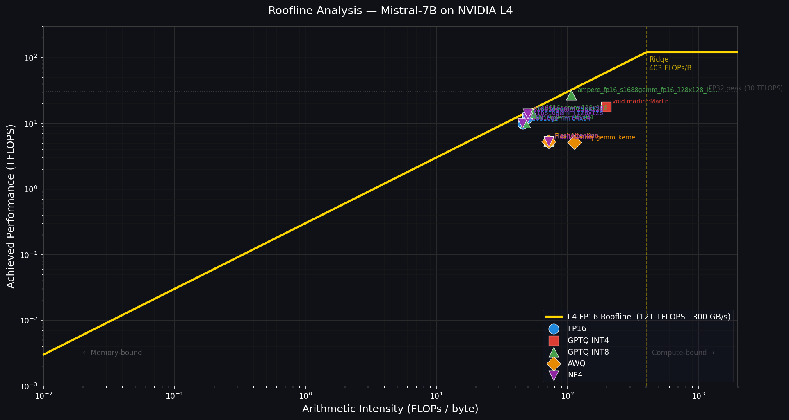

# HPML Final Project: Uncertainty-Aware Inference - How Quantization Affects LLM Confidence Calibration

> **Course:** High Performance Machine Learning (COMS 6998)
> **Semester:** Spring 2026
> **Instructor:** Dr. Kaoutar El Maghraoui

---
## Team Information
- **Team Name:** Team 29 (Team B)
- **Advisor / Mentor:** Ruchi Mahindru, Distinguished Engineer, IBM Research
- **Members:**
   - **Anubha Vyasamudri** (av3329): calibration pipeline, PyTorch profiling, report, slides
   - **Rohit Ramesh** (rr3713): CUDA/Nsight Compute profiling, Roofline analysis, report, slides
   - **Sanjita Chandan Ballapur** (sb5216): calibration pipeline, PyTorch profiling, report, slides
   - **Tamanna Ananna Haque** (ta2642): calibration evaluation, Nsight Compute profiling, report, slides
   - **Vishal Menon** (vm2820): calibration evaluation, vLLM serving infrastructure, report, slides
---
## Submission
- **GitHub repository:** [uncertainty-aware-inference](https://github.com/chuanbinp/uncertainty-aware-inference)
   - **Project subdirectory:** [`TeamB/`](https://github.com/chuanbinp/uncertainty-aware-inference/tree/master/TeamB)
- **Final report:** [`deliverables/Team29_HPML_Final_Report.pdf`](deliverables/Team29_HPML_Final_Report.pdf)
- **Final presentation:** [`deliverables/Team29_Final_Presentation.pptx`](deliverables/Team29_Final_Presentation.pptx)
- **Experiment-tracking dashboard:** [Weights & Biases dashboard](https://wandb.ai/Uncertainty_Aware_Inference_Lab/UAI_Project/)

The final report and presentation are included in the repository deliverables and were also submitted through CourseWorks.

---
## 1. Problem Statement
Large language model inference is expensive, and while post-training quantization (PTQ) can reduce latency, GPU memory use, and serving cost, standard evaluations usually focus on throughput and accuracy while overlooking whether the model's confidence remains trustworthy. This project studies inference-time optimization for Mistral-7B by evaluating how GPTQ INT4/INT8, AWQ INT4, and NF4 affect both hardware-level efficiency and confidence calibration across HellaSwag, TriviaQA, and PubMedQA. We profile each configuration using NVIDIA Nsight Compute on an L4 GPU to construct Roofline models from hardware counters, benchmark throughput under vLLM batched serving, and measure ECE, MCE, Brier score, and entropy to characterise whether calibration degradation is detectable from accuracy metrics alone. The central finding is that kernel implementation determines hardware efficiency more than bit-width, and that a single calibration metric is insufficient to detect the failure modes that quantization introduces under distribution shift.

---
## 2. Model/Application Description
This project uses **Mistral-7B-Instruct-v0.2** as the primary model and evaluates how post-training quantization affects both GPU kernel efficiency and confidence calibration across three question-answering datasets. Team B also provides the shared profiling toolkit used by Teams A and C for cross-model analysis.

- **Model architecture:** Mistral-7B-Instruct-v0.2, with sliding-window attention and grouped-query attention. Cross-model profiling extends to LLaMA-1 7B (Team A) and LLaMA-2 13B (Team C) using the same ncu scripts.
- **Framework / stack:** HuggingFace Transformers 4.51.3, AutoGPTQ 0.7.1, AutoAWQ 0.2.9, bitsandbytes 0.49.2, vLLM, PyTorch 2.6.0+cu124 (GCP L4) / PyTorch 2.12.0.dev+cu128 (Colab A100).
- **Configurations evaluated:**
  - **FP16 baseline** — full-precision Mistral-7B (mistralai/Mistral-7B-Instruct-v0.2)
  - **GPTQ INT4** — TheBloke/Mistral-7B-Instruct-v0.2-GPTQ, revision `main`, Marlin kernel
  - **GPTQ INT8** — TheBloke/Mistral-7B-Instruct-v0.2-GPTQ, revision `gptq-8bit-128g-actorder_True`
  - **AWQ INT4** — TheBloke/Mistral-7B-Instruct-v0.2-AWQ, fused awq\_gemm kernel
  - **NF4** — base model loaded via bitsandbytes, kDequantizeBlockwise kernel path

- **Datasets:**
  - **Name:** HellaSwag | **Size:** 17,215 examples | **License:** MIT | [HuggingFace](https://huggingface.co/datasets/hellaswag)
  - **Name:** TriviaQA | **Size:** 10,003 examples | **License:** Apache-2.0 | [HuggingFace](https://huggingface.co/datasets/trivia_qa)
  - **Name:** PubMedQA | **Size:** 1,000 expert-labeled examples | **License:** MIT | [HuggingFace](https://huggingface.co/datasets/pubmed_qa)

- **Custom modifications:** No custom CUDA kernels written. The Marlin W4A16 kernel (AutoGPTQ) and fused awq\_gemm kernel (AutoAWQ) are used unmodified. Original contributions are the ncu instrumentation scripts (`ncu_*.py`, `llama_workspace/ncu_*.py`), the roofline plotting utility (`plot_ncu_roofline.py`), the calibration evaluation pipeline (`run_eval.py`), and the PyTorch Profiler harness (`run_profiler.py`).
- **Hardware target:** NVIDIA A100 80 GB (Colab Pro) for calibration evaluation, PyTorch Profiler, and vLLM throughput benchmarking; NVIDIA L4 24 GB GDDR6 (GCP, asia-south1-b) for ncu kernel-level profiling.

---
## 3. Final Results Summary

### Calibration sweep — Mistral-7B

| Config | HellaSwag Acc | HellaSwag ECE | TriviaQA Acc | TriviaQA ECE | PubMedQA ECE | PubMedQA MCE |
|--------|--------------|--------------|-------------|-------------|-------------|-------------|
| FP16 | 82.9% | 0.277 | 70.1% | 0.143 | 0.229 | 0.330 |
| GPTQ INT4 | 82.5% | 0.289 | 68.1% | 0.152 | 0.077 | 0.302 |
| GPTQ INT8 | 81.9% | 0.283 | 67.8% | 0.155 | 0.103 | 0.944 |
| AWQ INT4 | 81.9% | 0.282 | 68.5% | 0.155 | 0.067 | 0.939 |
| NF4 | 82.6% | 0.279 | 68.7% | 0.158 | 0.236 | 0.330 |

### Systems profiling — Mistral-7B on L4 (ncu prefill, seq=128)

| Config | Dominant Kernel | SM% | AI (FLOPs/B) | vLLM tok/s | Peak Mem |
|--------|----------------|-----|-------------|-----------|---------|
| FP16 | s16816gemm (cuBLAS) | 52% | 243 | 942 | 14.5 GB |
| GPTQ INT4 | Marlin GEMM (W4A16) | 82% | 951 | **1,677** | 4.3 GB |
| GPTQ INT8 | s16816gemm 128×128 | 58% | 266 | 446 | 7.8 GB |
| AWQ INT4 | awq\_gemm\_kernel | 67% | 1,865 | 207 | 4.2 GB |
| NF4 | kDequantizeBlockwise | 81% | 388 | 89 | 4.4 GB |

**Hardware:** 1× NVIDIA L4 24 GB GDDR6, CUDA 12.4, PyTorch 2.6.0 (profiling); 1× NVIDIA A100 80 GB, CUDA 12.8, PyTorch 2.12.0.dev (calibration + vLLM).

**Headline result:**
*GPTQ INT4 with the Marlin kernel delivers 1.78× vLLM throughput and 71% memory reduction vs. FP16, shifts inference from memory-bound (SM=52%, AI=243 FLOPs/B) to compute-bound (SM=82%, AI=951 FLOPs/B), and incurs less than 1% accuracy degradation on in-distribution tasks. AWQ INT4's ECE drop on PubMedQA (0.067 vs 0.229) is a confidence redistribution artefact — MCE simultaneously triples from 0.330 to 0.939, a failure mode invisible to ECE alone.*

---
## 4. Repository Structure
```text
TeamB/
├── configs.py                         # Model registry for Mistral-7B, LLaMA-1 7B, LLaMA-2 13B
├── run_eval.py                        # Calibration evaluation — one config across all three datasets
├── run_vllm.py                        # vLLM throughput benchmarking — one config per run
├── run_profiler.py                    # PyTorch Profiler harness — decode latency, AI, kernel breakdown
├── ncu_fp16.py                        # Nsight Compute profiling scripts (Mistral-7B, one per config)
├── ncu_gptq_int4.py
├── ncu_gptq_int8.py
├── ncu_awq_int4.py
├── ncu_nf4.py
├── plot_ncu_roofline.py               # Roofline plot generation from ncu CSV output
├── nsight_roofline.py                 # NSight roofline helper utilities
├── nvtx_utils.py                      # NVTX range helpers for ncu kernel capture targeting
├── setup_gcp_l4.sh                    # One-shot GCP L4 environment setup (uai conda env, CUDA paths)
├── setup_colab.sh                     # One-shot Colab/A100 pip install script
├── requirements.txt                   # pip packages — A100/Colab env
├── requirements_gcp.txt               # pip packages — GCP L4 ncu env (uai conda)
├── environment_uai.yml                # Full conda env export for L4 reproduction
├── env.example                        # Template for HF_TOKEN and WANDB_API_KEY
├── .gitignore
├── LICENSE
├── deliverables/
│   ├── Team29_HPML_Final_Report.pdf
│   └── Team29_Final_Presentation.pptx
├── colab_notebooks/
│   ├── mistral_7b_calibration.ipynb   # Full PTQ calibration sweep (Colab A100)
│   ├── teamb_vllm.ipynb               # vLLM throughput benchmark (Colab A100)
│   └── teamb_profiler.ipynb           # PyTorch Profiler sweep (Colab A100)
├── llama_workspace/                   # LLaMA-1 7B and LLaMA-2 13B ncu profiling
│   ├── ncu_llama1_7b_*.py             # One script per config (fp16, gptq_int4/int8, awq_int4, nf4)
│   ├── ncu_llama2_13b_*.py
│   ├── run_llama_ncu.sh               # Batch ncu sweep for all LLaMA configs on L4
│   └── ncu_results/                   # Raw ncu CSV outputs (*_metrics.csv)
├── calibration_results/               # Per-config calibration JSONs, reliability diagrams, entropy plots
│   ├── mistral-7b-fp16/
│   ├── mistral-7b-gptq-int4/
│   ├── mistral-7b-gptq-int8/
│   ├── mistral-7b-awq-int4/
│   └── mistral-7b-nf4/
├── nsight_profiler_results/
│   ├── ncu/                           # *_metrics.csv files (raw .ncu-rep excluded via .gitignore)
│   └── roofline_*.png                 # Roofline plots per config and cross-model
├── pytorch_profiler_results/
│   ├── *_profile.json                 # Per-config timing, AI, and kernel breakdown JSON
│   ├── profiler_summary.json          # Combined summary across all 5 configs
│   └── roofline_mistral7b_A100-80GB.png
└── vllm_results/                      # Per-config vLLM throughput JSONs (Mistral + LLaMA cross-model)
```
---
## 5. Reproducibility Instructions
### A. Environment Setup
1. **Clone the repository:**
   ```bash
   git clone https://github.com/chuanbinp/uncertainty-aware-inference.git
   cd uncertainty-aware-inference
   ```

2. **For calibration evaluation and vLLM (Colab A100):**
   ```bash
   bash TeamB/setup_colab.sh
   ```

3. **For ncu kernel profiling (GCP L4 VM):**
   ```bash
   bash TeamB/setup_gcp_l4.sh
   conda activate uai
   # Or restore the exact conda environment:
   conda env create -f TeamB/environment_uai.yml
   conda activate uai
   ```

**System requirements:** Python 3.11, CUDA 12.4 (GCP L4 profiling) or CUDA 12.x (Colab calibration). FP16 inference requires ≥40 GB VRAM (A100 recommended). ncu profiling requires `perf_event_paranoid ≤ 0`. See `requirements.txt` and `requirements_gcp.txt` for pinned package versions.

### B. Experiment Tracking Dashboard
Public experiment-tracking dashboard with calibration metrics, vLLM throughput, and PyTorch Profiler results across all configurations. Each run is tagged by model, quantization method, and experiment type.

1. **W&B Dashboard:** [https://wandb.ai/Uncertainty_Aware_Inference_Lab/UAI_Project](https://wandb.ai/Uncertainty_Aware_Inference_Lab/UAI_Project)
> *Platform used:* Weights & Biases

### C. Dataset
Datasets are downloaded automatically on first run via HuggingFace Datasets — no manual download required:
- **HellaSwag** — commonsense reasoning completion, 17,215 examples (MIT)
- **TriviaQA** — factual closed-book QA, 10,003 examples (Apache-2.0)
- **PubMedQA** — biomedical out-of-distribution benchmark, 1,000 examples (MIT)

### D. Calibration Evaluation
Run the calibration sweep for a single quantization configuration. Results write to `calibration_results/{config}/`.

```bash
export HF_TOKEN=hf_your_token_here

# Single config
python TeamB/run_eval.py --config mistral-7b-fp16
python TeamB/run_eval.py --config mistral-7b-gptq-int4
python TeamB/run_eval.py --config mistral-7b-gptq-int8
python TeamB/run_eval.py --config mistral-7b-awq-int4
python TeamB/run_eval.py --config mistral-7b-nf4

# Subset of datasets or samples (useful for quick testing)
python TeamB/run_eval.py --config mistral-7b-fp16 --datasets hellaswag triviaqa
python TeamB/run_eval.py --config mistral-7b-awq-int4 --samples 200
```

Supported config keys are defined in `configs.py`. Results per config: `{dataset}_results.json` containing ECE, MCE, Brier score, average entropy, and per-sample predictions. Full sweep can also be run via `colab_notebooks/mistral_7b_calibration.ipynb`.

### E. vLLM Throughput Benchmarking
Benchmark tokens/second under batched vLLM serving. Each config runs in a subprocess for clean GPU state. NF4 falls back to HuggingFace batched generation automatically.

```bash
python TeamB/run_vllm.py --config mistral-7b-fp16      --output-dir TeamB/vllm_results
python TeamB/run_vllm.py --config mistral-7b-gptq-int4  --output-dir TeamB/vllm_results
python TeamB/run_vllm.py --config mistral-7b-gptq-int8  --output-dir TeamB/vllm_results
python TeamB/run_vllm.py --config mistral-7b-awq-int4   --output-dir TeamB/vllm_results
python TeamB/run_vllm.py --config mistral-7b-nf4        --output-dir TeamB/vllm_results
```

Output: `vllm_results/{config}_vllm.json` per config. Full sweep via `colab_notebooks/teamb_vllm.ipynb`.

### F. PyTorch Profiler
Profile decode latency, peak GPU memory, and kernel breakdown. Output: `*_profile.json` (timing + AI) and `*_chrome.json` (open at [perfetto.dev](https://ui.perfetto.dev)).

```bash
# Single config
python TeamB/run_profiler.py --config mistral-7b-fp16

# All configs sequentially
python TeamB/run_profiler.py --all

# Force re-profile even if JSON exists
python TeamB/run_profiler.py --all --force

# With W&B logging
python TeamB/run_profiler.py --config mistral-7b-fp16 \
    --wandb-project UAI_Project \
    --wandb-entity Uncertainty_Aware_Inference_Lab
```

Full sweep via `colab_notebooks/teamb_profiler.ipynb`.

### G. ncu Kernel-Level Profiling (GCP L4)
Collect hardware counters (SM%, DRAM%, FLOPs, duration) for Roofline construction. Requires GCP L4 with the `uai` conda env activated.

```bash
conda activate uai
export HF_TOKEN=hf_your_token_here

# Mistral-7B — single config example (FP16)
sudo rm -f /tmp/nsight-compute-lock
sudo -E /usr/local/cuda/bin/ncu \
    -o TeamB/nsight_profiler_results/ncu/mistral_fp16 \
    --metrics gpu__time_duration.sum,dram__bytes.sum,sm__inst_executed_pipe_tensor.sum,\
smsp__sass_thread_inst_executed_op_ffma_pred_on.sum,\
sm__throughput.avg.pct_of_peak_sustained_elapsed,\
gpu__dram_throughput.avg.pct_of_peak_sustained_elapsed \
    --launch-skip 30 --launch-count 20 \
    --kernel-name "regex:ampere_fp16_s16816gemm|fmha_cutlassF" \
    --force-overwrite \
    ~/miniconda3/envs/uai/bin/python TeamB/ncu_fp16.py

# Extract CSV from .ncu-rep
/usr/local/cuda/bin/ncu --import TeamB/nsight_profiler_results/ncu/mistral_fp16.ncu-rep \
    --csv --print-units base 2>/dev/null \
    > TeamB/nsight_profiler_results/ncu/mistral_fp16_metrics.csv

# LLaMA-1 7B and LLaMA-2 13B sweep (all 9 configs)
cd TeamB/llama_workspace && bash run_llama_ncu.sh

# Generate Roofline plots from CSV
python TeamB/plot_ncu_roofline.py \
    --csv TeamB/nsight_profiler_results/ncu/mistral_fp16_metrics.csv \
          TeamB/nsight_profiler_results/ncu/mistral_gptq_int4_metrics.csv \
    --label "FP16" "GPTQ INT4 (Marlin)" \
    --out TeamB/nsight_profiler_results/roofline_comparison.png
```

### H. Quickstart: Reproduce the Headline Result
The following reproduces the 1.78× throughput result (approximately 5 minutes on A100):

```bash
# 1. Install dependencies
bash TeamB/setup_colab.sh

# 2. Run vLLM benchmarks
export HF_TOKEN=hf_your_token_here
python TeamB/run_vllm.py --config mistral-7b-fp16      --output-dir ./results
python TeamB/run_vllm.py --config mistral-7b-gptq-int4  --output-dir ./results

# 3. Compare
python -c "
import json
fp16  = json.load(open('results/mistral-7b-fp16_vllm.json'))
gptq4 = json.load(open('results/mistral-7b-gptq-int4_vllm.json'))
ratio = gptq4['avg_tokens_per_second'] / fp16['avg_tokens_per_second']
print(f'FP16:      {fp16[\"avg_tokens_per_second\"]:.1f} tok/s')
print(f'GPTQ INT4: {gptq4[\"avg_tokens_per_second\"]:.1f} tok/s')
print(f'Speedup:   {ratio:.2f}x')
"
```

---

## 6. Results and Observations

- **Kernel implementation determines hardware efficiency, not bit-width.** GPTQ INT4 (Marlin) is compute-bound (SM=82%, AI=951 FLOPs/B) and delivers 1.78× vLLM throughput. GPTQ INT8 with the exllama kernel regresses to 0.47× FP16 despite being a smaller model — different kernel, opposite outcome.
- **19× arithmetic intensity gap at identical 4-bit precision.** NF4 (AI=388 FLOPs/B, two-step kDequantize+GEMM) vs. AWQ INT4 (AI=1,865 FLOPs/B, fused awq\_gemm kernel). Same bit-width, entirely different hardware regimes.
- **AWQ paradox.** AWQ INT4 achieves the highest arithmetic intensity of any config (1,865 FLOPs/B) but only 207 tok/s under vLLM. The fused GEMV kernel is optimised for single-batch prefill, not continuous batched decode — throughput collapses at batch size 10.
- **ECE alone is insufficient on OOD data.** On PubMedQA, AWQ INT4 ECE drops to 0.067 (vs FP16's 0.229) while MCE triples to 0.939. Quantization spreads confidence uniformly, reducing average bin error while catastrophically miscalibrating the worst-case bin.
- **NF4 is calibration-conservative but throughput-constrained.** The only configuration where ECE, MCE, Brier, and entropy all remain close to FP16 on PubMedQA — at the cost of 0.09× vLLM throughput.
- **What did not work.** Knowledge distillation (FP16 teacher → NF4 student) at T≥2 causes MCE explosion even as ECE appears to improve. At T≥4 accuracy collapses entirely. Confidence-threshold routing for Mistral-7B produces negative cost savings at batch=1 because kernel overhead exceeds the memory saving.



---

## 7. Notes

- Large binary files (`.ncu-rep`, `.pt` tensors, Chrome traces) are excluded via `.gitignore`. Only `*_metrics.csv` and `*_profile.json` summaries are committed.
- Two separate environments are required: `uai` conda env (CUDA 12.4, PyTorch 2.6.0, `auto-gptq==0.7.1`) for ncu profiling on the GCP L4 VM; the Colab A100 notebook environment (CUDA 12.8, PyTorch 2.12.0.dev) for calibration evaluation and vLLM benchmarking.
- All secrets (API keys, W&B tokens) are loaded from environment variables. See `env.example`.
- HuggingFace model checkpoints are not committed. All models download automatically via `HF_TOKEN`. Llama-2 and Mistral are gated models requiring HF account access.

### AI Use Disclosure
*Per the HPML AI Use Policy (posted on CourseWorks). Required for every submission.*

**Did your team use any AI tool in completing this project?**
- [ ] No, we did not use any AI tool.
- [x] Yes, we used AI assistance as described below.

**Tool(s) used:** Claude (Anthropic)

**Specific purpose:** AI-assisted toold were used in limited capacity; Debugging CUDA permission errors; fixing package conflicts that arose during execution due to circular dependencies; proofreading and polishing prose in the report once fully written by the team.

**Sections affected:** Profiling ⁠initial setup to translate between A100 and L4, written presentation material.

**How we verified correctness:** All reported experimental results were produced by running scripts independently on the target hardware and confirmed against raw JSON outputs in `calibration_results/`, `vllm_results/`, `pytorch_profiler_results/`, and `nsight_profiler_results/`. All profiler-trace interpretations were confirmed against raw `.ncu-rep` files opened in NVIDIA Nsight Compute GUI. No AI tool generated any numerical result or profiling interpretation. Authors conducted all the detailed analysis.

By submitting this project, the team confirms that the analysis, interpretations, and conclusions are our own, and that any AI assistance is fully disclosed above. The same disclosure block appears as an appendix in the final report.

### License
Released under the MIT License. See [`LICENSE`](LICENSE).

### Citation
If you build on this work, please cite:
```bibtex
@misc{team29_2026_uai,
  title  = {Uncertainty-Aware Inference: How Post-Training Quantization Affects LLM Confidence Calibration},
  author = {Vyasamudri, Anubha and Ramesh, Rohit and Ballapur, Sanjita Chandan
            and Haque, Tamanna Ananna and Menon, Vishal},
  year   = {2026},
  note   = {HPML Spring 2026 Final Project, Columbia University},
  url    = {https://github.com/chuanbinp/uncertainty-aware-inference/tree/master/TeamB}
}
```

### Medium Article for Extra Credit
[Why the Quantization Kernel Matters More Than the Bit-Width](https://medium.com/@rohitramesh4547/why-the-quantization-kernel-matters-more-than-the-bit-width-def5a71a642f)

### Contact
Open a GitHub Issue or email *[rr3713@columbia.edu](mailto:rr3713@columbia.edu)*.

---
*HPML Spring 2026 — Dr. Kaoutar El Maghraoui — Columbia University*
